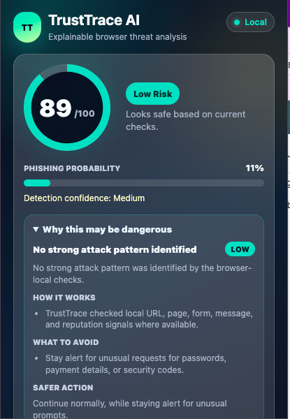
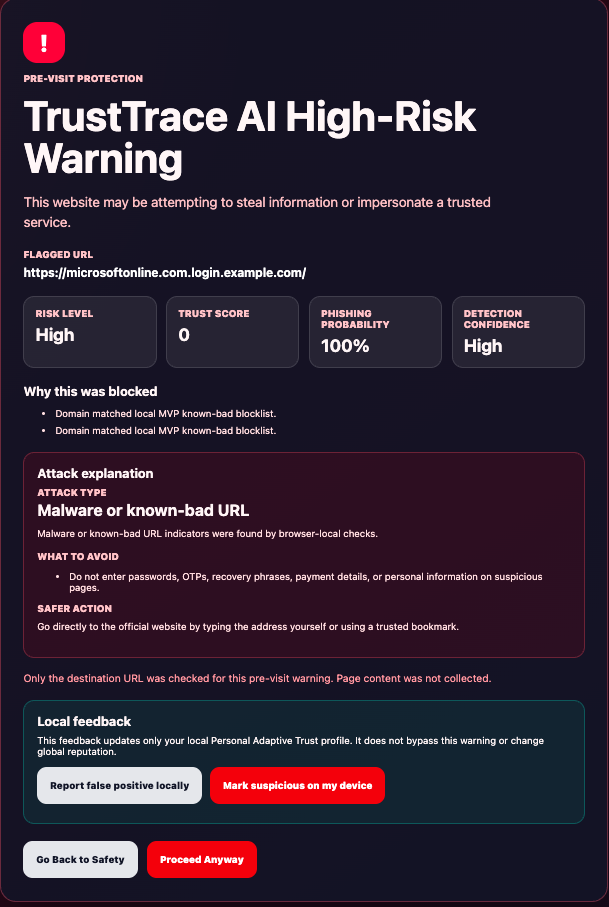
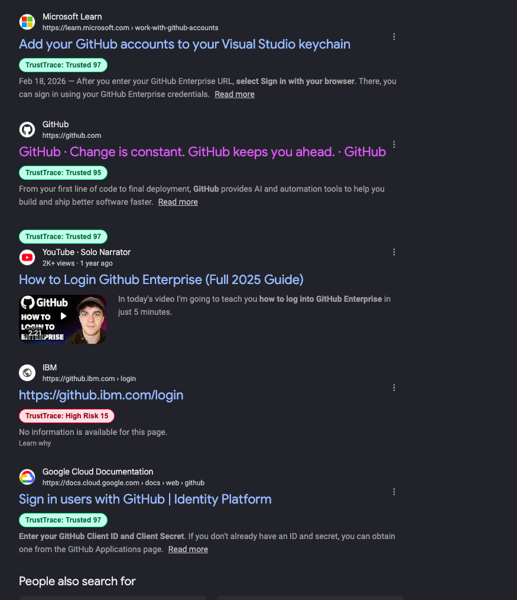
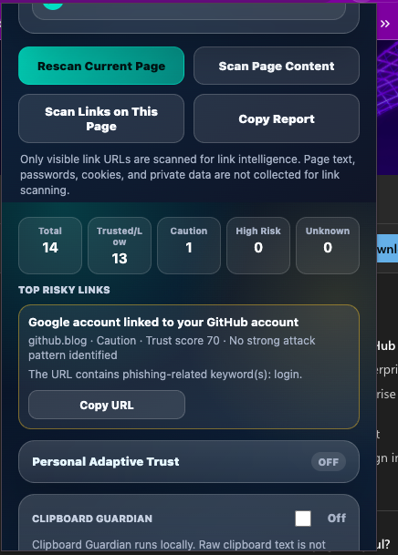
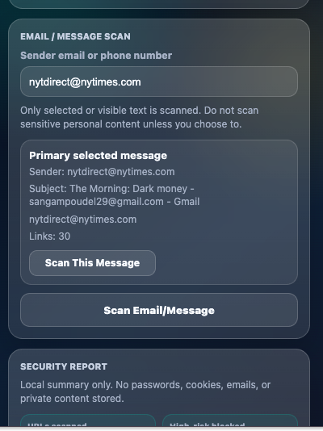
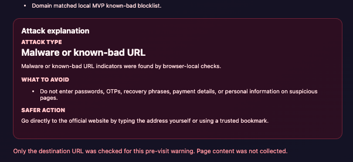
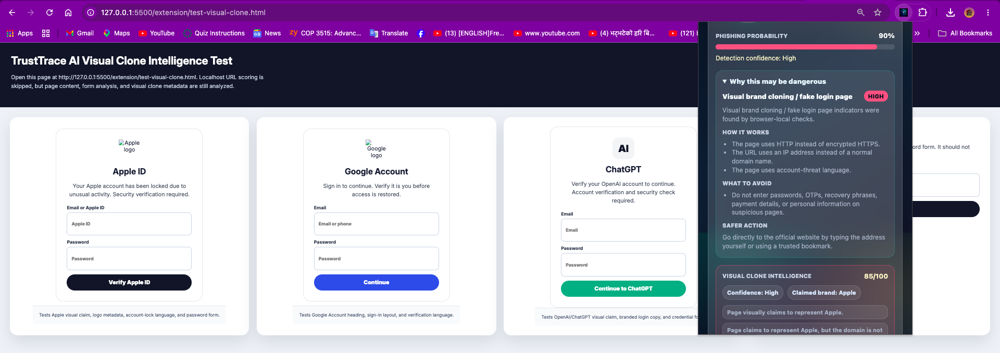

# TrustTrace AI - Explainable AI Browser Security Extension

An explainable browser security extension that detects phishing websites, suspicious links, fake login forms, scam messages, and brand impersonation using layered risk scoring and real-time warnings.

## Problem Statement

Many phishing defenses rely on simple blocklists or single-signal checks. That approach can miss newer scams, and it can also create false positives when a legitimate website uses normal login, account, or form language.

TrustTrace AI combines multiple explainable signals: URL structure, domain legitimacy, local reputation, page content, login forms, message text, sender identity, link mismatch, repeated-message history, and attack explanations. The goal is not just to say “risky” or “safe,” but to explain what the attack might be and what the user should avoid doing.

This is a local MVP portfolio project. External threat intelligence APIs and machine learning models are designed as future integration points, not claimed as production integrations today.

## Key Features

| Feature | What it does |
|---|---|
| Real-time URL risk scoring | Scores URLs through a local FastAPI backend. |
| Trust score and phishing probability | Returns `trust_score`, `phishing_probability`, and `risk_level`. |
| Official domain/reputation layer | Reduces false positives for trusted domains like Apple, OpenAI, Google, and Microsoft. |
| Trusted commerce context | Allows trusted retailers/carriers to mention brands in product listings without false brand-impersonation warnings. |
| Deep URL heuristics | Detects suspicious TLDs, IP hosts, punycode, homoglyphs, typosquatting, and brand spoofing. |
| Page content scanning | Checks visible text for urgency, credential, account threat, payment, and scam language. |
| Fake login form detection | Detects suspicious password forms, cross-domain form actions, missing actions, and HTTP credential collection. |
| Email/message threat detection | User-controlled scan of selected or visible message text. |
| Sender identity analysis | Flags free-email impersonation, brand/domain mismatches, and suspicious phone senders. |
| Repeated scam message detection | Stores local message hashes to detect repeated similar messages without storing full bodies. |
| Universal link intelligence | Scans visible links on any page and summarizes trusted, caution, high-risk, and unknown links. |
| Search result annotation | Adds TrustTrace risk badges beside visible Google, Bing, DuckDuckGo, and Yahoo results. |
| Pre-visit high-risk warning page | Redirects high-risk navigation to a serious warning interstitial. |
| Medium-risk caution banner | Injects a yellow caution banner for medium-risk pages. |
| Attack explanation mode | Explains attack type, how it works, what to avoid, and safer action. |
| Personal Security Report Card | Local summary of scans, blocked threats, caution pages, risky links, repeated scams, and common attack types. |
| Clipboard Guardian Mode | Optional local clipboard risk checks for suspicious URLs, OTPs, wallet addresses, recovery phrases, credentials, and copy-value mismatch risks. |
| Visual Clone Intelligence | Detects metadata-based brand visual claims, fake branded login layouts, logo/favicons hints, and official-domain mismatches without collecting screenshots. |
| Demo Mode | Provides sample scenario cards and local demo page links for quick recruiter/reviewer walkthroughs. |
| Personal Adaptive Trust | Optional local domain-level learning that uses safe scan history and user feedback to make small trust adjustments only on the current user's browser. |
| Privacy-first design | Local backend, no cookies/password collection, user-controlled message scans, resettable local stats. |

## Architecture Overview

```text
Chrome Extension
  popup UI | content script | service worker
        |
        v
FastAPI Backend
        |
        v
Multi-Layer Threat Scoring Pipeline
        |
        v
Popup Dashboard | Warning Page | Caution Banner | Search Badges
```

The extension collects only the data needed for the selected workflow. The backend applies rule-based scoring and returns explainable risk results. The UI then displays the trust score, grouped signals, and attack explanation.

## Multi-Layer Detection Pipeline

1. Local known-bad / future threat intelligence
   - Local MVP blocklist for safe test domains.
   - Placeholders for Google Safe Browsing, PhishTank, OpenPhish, URLHaus, VirusTotal, and hosts feeds.
2. Reputation and legitimacy
   - Official trusted brand domain verification.
   - Local high-reputation allowlist for MVP testing.
   - Trusted commerce/retailer context for product pages such as Apple iPhone listings on Verizon, Best Buy, Amazon, Walmart, and similar domains.
   - Future placeholders for Tranco, RDAP/domain age, URLScan, and certificate reputation.
3. URL and domain heuristics
   - HTTP, suspicious TLDs, IP hosts, encoded characters, URL shorteners, long queries, typosquatting, punycode, homoglyphs, and brand spoofing.
4. Page/form/message analysis
   - Visible text, fake login forms, sender identity, message links, link text/domain mismatch, and repeated-message detection.
5. Attack explanation engine
   - Rule-based classification of likely attack type with educational guidance.
6. Personal Security Report Card
   - Local-only summary counters for protection activity.
7. Clipboard Guardian Mode
   - Opt-in local clipboard safety checks; non-URL clipboard text is not sent to the backend.
8. Visual Clone Intelligence
   - Metadata-only brand clone checks using title, headings, favicon/logo metadata, button text, input labels, layout hints, and official domain verification.
9. Demo Mode
   - Static, clearly labeled sample scenarios for portfolio walkthroughs; no private content scanned and no report-card stats changed.
10. Personal Adaptive Trust
   - Opt-in local domain-level metadata for repeated safe scans and user feedback.
   - Bounded adjustments that cannot override strong phishing, fake login, known-bad, visual clone, or typosquatting evidence.
11. Future community reputation
   - Design placeholder for global signals that would require many independent reports, deduplication, rate limits, and abuse checks.
   - A single user complaint never changes TrustTrace detection for everyone.
12. Future ML/community learning
   - Placeholder architecture for URL classifiers, community reports, and richer threat intelligence.

## Screenshots

These are placeholders for GitHub portfolio screenshots.









## Tech Stack

- Chrome Extension Manifest V3
- JavaScript, HTML, CSS
- Python
- FastAPI
- Pydantic
- SQLite
- Git/GitHub
- Rule-based explainable scoring
- Future-ready API/ML placeholders

## Local Setup

1. Clone the repository.

```bash
git clone <your-repo-url>
cd TrustTraceAI
```

2. Create and activate a Python virtual environment.

```bash
cd backend
python3 -m venv .venv
source .venv/bin/activate
```

3. Install backend dependencies.

```bash
pip install -r requirements.txt
```

4. Run the FastAPI backend.

```bash
python3 -m uvicorn app.main:app --reload --host 127.0.0.1 --port 8000
```

5. Load the Chrome extension.

- Open `chrome://extensions`
- Enable Developer mode
- Click Load unpacked
- Select the `extension/` folder

6. Start a local test server from the repository root.

```bash
cd ..
python3 -m http.server 5500
```

7. Open local test pages in Chrome.

```text
http://127.0.0.1:5500/extension/test-phishing.html
http://127.0.0.1:5500/extension/test-scam-message.html
http://127.0.0.1:5500/extension/test-previsit-links.html
http://127.0.0.1:5500/extension/test-universal-links.html
http://127.0.0.1:5500/extension/test-attack-explanations.html
http://127.0.0.1:5500/extension/test-clipboard-guardian.html
http://127.0.0.1:5500/extension/test-visual-clone.html
http://127.0.0.1:5500/extension/test-adaptive-trust.html
http://127.0.0.1:5500/extension/demo.html
```

## Demo Workflow

Use this as a quick portfolio walkthrough:

1. Open the popup and click Run Demo Scan.
   - Show sample cards for trusted official sites, phishing URLs, visual clones, scam messages, Clipboard Guardian, universal links, attack explanations, and the report card.
2. Click Open Demo Pages.
   - Show the local test page list and the `test-universal-links.html` page.
3. Scan an official website such as `https://www.apple.com` or `https://openai.com`.
   - Show low risk, high trust score, and trust signals.
4. Scan a fake phishing URL such as `http://apple-login-security.example.com/verify`.
   - Show high risk, local blocklist/deep URL signals, and attack explanation.
5. Click a fake high-risk link from `test-previsit-links.html`.
   - Show the warning page and Proceed Anyway session bypass.
6. Scan `test-phishing.html`.
   - Show fake login form detection and credential-harvesting explanation.
7. Scan `test-scam-message.html`.
   - Show sender impersonation, message threat detection, suspicious link analysis, and repeated scan count.
8. Scan links on `test-universal-links.html`.
   - Show total scanned links, trusted/caution/high-risk counts, and top risky links.
9. Open a Google search page.
   - Show TrustTrace search result badges beside visible results.
10. Open the Security Report section in the popup.
   - Show local totals, high-risk blocks, caution warnings, repeated scams, and most common attack type.
11. Turn on Clipboard Guardian and scan the clipboard test page.
   - Show suspicious URL, wallet mismatch, OTP/code, and recovery phrase warnings.
12. Scan `test-visual-clone.html`.
   - Show Visual Clone Intelligence, claimed brands, brand-domain mismatch signals, and fake branded login explanation.
13. Open `test-adaptive-trust.html`.
   - Turn on Personal Adaptive Trust, scan a trusted domain, mark it trusted on your device, and show the small local trust signal.

## Testing Pages

- `extension/test-phishing.html` - local fake login page.
- `extension/test-scam-message.html` - scam email/message cards.
- `extension/test-previsit-links.html` - safe and risky navigation links.
- `extension/test-universal-links.html` - mixed visible links for page-wide scanning.
- `extension/test-attack-explanations.html` - examples for attack explanation mode.
- `extension/test-clipboard-guardian.html` - clipboard risk scenarios.
- `extension/test-visual-clone.html` - metadata-only visual brand clone scenarios.
- `extension/test-adaptive-trust.html` - opt-in local domain learning walkthrough.
- `extension/test-regression-dashboard.html` - final QA dashboard linking to regression fixtures and test URLs.
- `extension/demo.html` - static portfolio demo dashboard.

## Quality Assurance / Regression Testing

TrustTrace AI includes a final QA workflow for manual and API regression checks:

- Manual checklist: [docs/testing_checklist.md](docs/testing_checklist.md)
- QA command reference: [docs/qa_commands.md](docs/qa_commands.md)
- API regression script: `backend/tests/regression_api_tests.py`
- Local regression dashboard: `http://127.0.0.1:5500/extension/test-regression-dashboard.html`

Run the API regression script while the backend is running:

```bash
python3 backend/tests/regression_api_tests.py
```

The regression suite checks official trusted domains, trusted commerce product context, fake phishing URLs, typosquatting/lookalike cases, and false-positive protections.

## Privacy And Safety

- Pre-visit warnings use URL-only checks.
- TrustTrace AI does not collect passwords.
- TrustTrace AI does not collect cookies.
- Email/message scans are user-controlled.
- Link scanning uses visible URLs plus lightweight link text/context only.
- Repeated message detection stores hashes and short metadata, not full message bodies.
- Security Report Card stores local summary counts only and includes a reset option.
- Clipboard Guardian is off by default and reads clipboard text only after the user clicks Scan Clipboard Now.
- Non-URL clipboard text is analyzed locally and is not sent to the backend.
- Visual Clone Intelligence collects DOM metadata only, such as titles, headings, favicon/logo URLs, image alt text, button text, input labels, and layout hints.
- Visual Clone Intelligence does not collect screenshots, canvas pixels, or image binaries.
- Product pages on trusted commerce domains can mention brands without being treated as fake brand identity pages.
- Demo Mode uses clearly labeled sample results and does not scan private content or update real report-card stats.
- Personal Adaptive Trust is opt-in and stores only local domain-level metadata such as scan counts, feedback counts, last risk level, last trust score, and a bounded adjustment.
- Personal Adaptive Trust affects only the current user's browser. One user report does not change global TrustTrace reputation.
- Personal Adaptive Trust does not store full URL paths, query strings, page text, messages, clipboard content, passwords, cookies, form values, tokens, or full browsing history.
- Personal Adaptive Trust cannot turn strong phishing evidence into a safe result.
- Future community reputation would require many independent reports, rate limits, deduplication, and verified-source weighting before any global signal is considered.
- API keys are not stored in the frontend; external APIs are future backend integrations.
- The MVP runs locally and does not send data to third-party threat intelligence services.

## Roadmap

Completed:

- MVP 1: Clean extension and FastAPI foundation.
- MVP 2: URL phishing analysis.
- MVP 3: Reputation and legitimacy layer.
- MVP 4: Page content scanning.
- MVP 5: Fake login form detection.
- MVP 6: Email/message threat detection.
- MVP 7: Pre-visit warning page and caution banner.
- MVP 8: Local threat intelligence, deep URL heuristics, universal link intelligence, and search result annotation.
- MVP 9: Attack Explanation Mode.
- MVP 10: Personal Security Report Card.
- MVP 11: Clipboard Guardian Mode.
- MVP 12: Visual Clone Intelligence.
- MVP 13: Demo Mode.
- MVP 14: Personal Adaptive Trust with future community reputation design.
- Final QA / Regression Test Suite.

Future:

- Real Google Safe Browsing / PhishTank / URLHaus integration.
- Tranco/RDAP/URLScan integration.
- ML URL classifier.
- Screenshot similarity and computer-vision clone detection after explicit privacy review.
- QR code phishing scanner.
- Community threat intelligence.
- Community reputation with independent-report thresholds and abuse protection.
- Personal Security Report Card enhancements.

## Resume Bullets

- Built TrustTrace AI, a Chrome Extension MV3 and FastAPI cybersecurity tool that detects phishing URLs, fake login forms, scam messages, sender impersonation, suspicious links, and repeated campaign patterns with explainable risk scoring.
- Designed a multi-layer threat pipeline combining local reputation checks, URL/domain heuristics, page/form/message analysis, pre-visit warnings, search result annotations, and rule-based attack explanations.
- Implemented privacy-first browser security workflows including user-controlled message scanning, URL-only pre-visit checks, local SQLite hash-based repeat detection, and no cookie/password collection.

### Search Result Badge Troubleshooting

If the TrustTrace inline score does not appear under Google search results, check browser extensions first.

Some ad blockers, privacy extensions, or script blockers may hide or block injected UI elements on search pages.

To test:

1. Temporarily disable ad blockers or privacy/script-blocking extensions.
2. Reload the Google search results page.
3. Reload TrustTrace AI from `chrome://extensions`.
4. Search again, for example:
   - `github`
   - `apple login`
   - `openai`

Expected result:

`TrustTrace: Trusted 95`

or another TrustTrace score badge should appear under search results.

If the badge appears after disabling the ad blocker, TrustTrace AI is working correctly. The issue is caused by another extension blocking or modifying the search-result page.